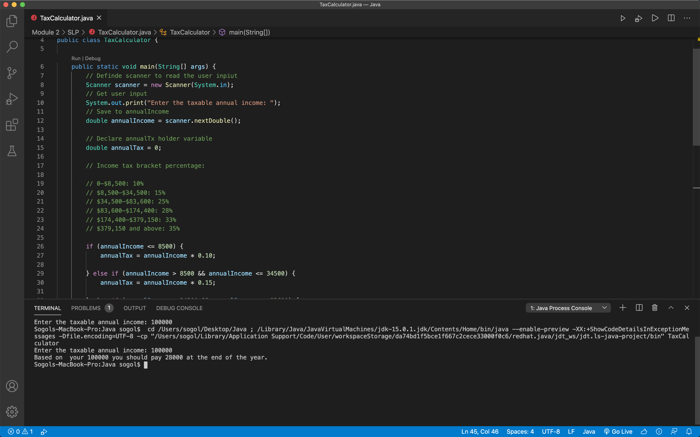

**Learn iOS App Development**
This is for [iOS App Development](https://www.udemy.com/course/ios-13-app-development-bootcamp) course from Udemy.

- [Section 1: Getting Started with iOS 13 and Swift](#section-1-getting-started-with-ios-13-and-swift)
  - [Intro to the Course. What's coming up?](#intro-to-the-course-whats-coming-up)
  - [Download the Course Syllabus](#download-the-course-syllabus)
  - [The Giant List of Resources](#the-giant-list-of-resources)
  - [How does an App Work?](#how-does-an-app-work)
  - [How to Make an App](#how-to-make-an-app)
  - [How to Get All the Free Stuff](#how-to-get-all-the-free-stuff)
  - [Download your Massive Bundle of Assets](#download-your-massive-bundle-of-assets)
  - [Download the 12 Rules to Learn to Code eBook PDF](#download-the-12-rules-to-learn-to-code-ebook-pdf)
  - [How to Make the Most of the Bootcamp](#how-to-make-the-most-of-the-bootcamp)
  - [How to Get Help When You're Stuck](#how-to-get-help-when-youre-stuck)
  - [Can I use Windows to develop iOS apps? (and other](#can-i-use-windows-to-develop-ios-apps-and-other)
  - [Developing for iOS - Tools and Materials](#developing-for-ios---tools-and-materials)
  - [Getting set up with Xcode](#getting-set-up-with-xcode)
  - [Pathfinder](#pathfinder)
- [Section 2: Xcode Storyboards and Interface Builder](#section-2-xcode-storyboards-and-interface-builder)
  - [The I am Rich App](#the-i-am-rich-app)
  - [A Note About the Next Lesson](#a-note-about-the-next-lesson)
  - [Let's Create a Brand New Xcode Project](#lets-create-a-brand-new-xcode-project)
  - [A Walkthrough of the Xcode Development Environment](#a-walkthrough-of-the-xcode-development-environment)
  - [Let's Design the User Interface!](#lets-design-the-user-interface)
  - [Let's Incorporate Some Image Assets](#lets-incorporate-some-image-assets)
  - [How to Design and Add an App Icon](#how-to-design-and-add-an-app-icon)
  - [A Note About the Next Lesson](#a-note-about-the-next-lesson-1)
  - [Run Your App on Your iPhone or Simulator](#run-your-app-on-your-iphone-or-simulator)
  - [Join the Student Community](#join-the-student-community)
- [Section 3: Xcode Storyboard and Interface Builder Challenge](#section-3-xcode-storyboard-and-interface-builder-challenge)
  - [What You Will Create](#what-you-will-create)
  - [Step 1: Create a New Xcode Project](#step-1-create-a-new-xcode-project)
  - [Step 2: Add a Label Element from the Object Library](#step-2-add-a-label-element-from-the-object-library)
  - [Step 3: Add an Image View to the Storyboard](#step-3-add-an-image-view-to-the-storyboard)
  - [Step 4: Add an App Icon](#step-4-add-an-app-icon)
  - [Step 5: Run Your App](#step-5-run-your-app)
  - [Step 6: Show off your work!](#step-6-show-off-your-work)
  - [Tip from Angela - Habit Building with the Calendar Trick](#tip-from-angela---habit-building-with-the-calendar-trick)
- [Section 4: Swift Programming Basics Collections, Constants & Variables](#section-4-swift-programming-basics-collections-constants--variables)
  - [What You'll Make by the End of This Module](#what-youll-make-by-the-end-of-this-module)
  - [Cloning from GitHub and How to Download the L.A.B. Project Stubs](#cloning-from-github-and-how-to-download-the-lab-project-stubs)
  - [How to Design Your App](#how-to-design-your-app)
  - [Let's Link Our Design to Our Code](#lets-link-our-design-to-our-code)
  - [Responding to User Interactions with IBActions](#responding-to-user-interactions-with-ibactions)
  - [Bug Hint ?Thread 1: signal SIGABRT and "Not Key Value Coding Compliant"](#bug-hint-thread-1-signal-sigabrt-and-not-key-value-coding-compliant)
  - [[Swift Deep Dive] Naming Conventions, Commenting and String Interpolation](#swift-deep-dive-naming-conventions-commenting-and-string-interpolation)
  - [Storing Data using Variables and Arrays](#storing-data-using-variables-and-arrays)
  - [[Swift Deep Dive] Variables](#swift-deep-dive-variables)
  - [[Swift Deep Dive] Arrays](#swift-deep-dive-arrays)
  - [How to Randomise the Dice Images](#how-to-randomise-the-dice-images)
  - [?How to Solve the Error: "Maximum number of apps for free development reached"](#how-to-solve-the-error-maximum-number-of-apps-for-free-development-reached)
  - [[Swift Deep Dive] Constants, the Range Operator and Randomisation](#swift-deep-dive-constants-the-range-operator-and-randomisation)
  - [Download the Completed App Project](#download-the-completed-app-project)
  - [Do You Want This?](#do-you-want-this)
  - [Tip from Angela - Dealing with Distractions](#tip-from-angela---dealing-with-distractions)
- [Section 5: Swift Programming Basics Challenge](#section-5-swift-programming-basics-challenge)
  - [What You Will Create](#what-you-will-create-1)
  - [Step 1: Clone the Starting Project](#step-1-clone-the-starting-project)
  - [Step 2: Design the User Interface](#step-2-design-the-user-interface)
  - [Step 3: Link Up the Design with Code](#step-3-link-up-the-design-with-code)
  - [Step 4: Use Code to Change the 8 Ball Image](#step-4-use-code-to-change-the-8-ball-image)
  - [Step 5: Make the Ball Image Random](#step-5-make-the-ball-image-random)
  - [Step 6: Show off your work!](#step-6-show-off-your-work-1)
  - [Download the Completed Project](#download-the-completed-project)
  - [Tip from Angela - Nothing Easy is Worth Doing!](#tip-from-angela---nothing-easy-is-worth-doing)
- [Section 6: Auto Layout and Responsive UIs](#section-6-auto-layout-and-responsive-uis)
  - [Why do we need Auto Layout?](#why-do-we-need-auto-layout)
  - [Size Classes Explained](#size-classes-explained)
  - [Setting Constraints and working with the Safe Area](#setting-constraints-and-working-with-the-safe-area)
  - [How to use Alignment and Pinning](#how-to-use-alignment-and-pinning)
  - [Working with Containers and Subviews](#working-with-containers-and-subviews)
  - [Stack Views](#stack-views)
  - [Auto Layout (Optional) Boss Challenge](#auto-layout-optional-boss-challenge)
  - [Download the Completed Project](#download-the-completed-project-1)
  - [Calculator Challenge Solution and Walkthrough](#calculator-challenge-solution-and-walkthrough)
  - [Tip from Angela - How to Deal with Procrastination](#tip-from-angela---how-to-deal-with-procrastination)
- [Section 7: Using and Understanding Apple Documentation](#section-7-using-and-understanding-apple-documentation)
  - [What You'll Make by the End of this Module](#what-youll-make-by-the-end-of-this-module-1)
  - [Setting up the Xylophone Project](#setting-up-the-xylophone-project)
  - [The 5 Step Approach to Solve Any Programming Problem](#the-5-step-approach-to-solve-any-programming-problem)
  - [[Swift Deep Dive] Functions and Scope](#swift-deep-dive-functions-and-scope)
  - [[Coding Exercise] Functions Part 1](#coding-exercise-functions-part-1)
  - [Linking Multiple Buttons to the Same IBAction](#linking-multiple-buttons-to-the-same-ibaction)
  - [[Swift Deep Dive] Functions with Inputs and Type Inference](#swift-deep-dive-functions-with-inputs-and-type-inference)
  - [Playing Different Xylophone Sounds](#playing-different-xylophone-sounds)
  - [Boss Challenge](#boss-challenge)
  - [Download the Completed App Project](#download-the-completed-app-project-1)
  - [Tip from Angela - Building a Programming Habit](#tip-from-angela---building-a-programming-habit)
- [Section 8: Intermediate Swift Programming Control Flow and Optionals](#section-8-intermediate-swift-programming-control-flow-and-optionals)
  - [What You'll Make by the End of this Module](#what-youll-make-by-the-end-of-this-module-2)
  - [Setting up the Egg Timer Project and Linking theStoryboard and View Controller](#setting-up-the-egg-timer-project-and-linking-thestoryboard-and-view-controller)
  - [[Swift Deep Dive] If-Else Control Flow](#swift-deep-dive-if-else-control-flow)
  - [[Swift Deep Dive] Switch Statements](#swift-deep-dive-switch-statements)
  - [Conditional Statements Challenge Solution](#conditional-statements-challenge-solution)
  - [[Swift Deep Dive] Dictionaries](#swift-deep-dive-dictionaries)
  - [[Swift Deep Dive] Defining and Unwrapping Optionals](#swift-deep-dive-defining-and-unwrapping-optionals)
  - [Dictionary Challenge Solution](#dictionary-challenge-solution)
  - [Implementing a Countdown Timer Challenge](#implementing-a-countdown-timer-challenge)
  - [Egg Timer Challenge Solution](#egg-timer-challenge-solution)
  - [Showing the Timer to the User with a Progress View](#showing-the-timer-to-the-user-with-a-progress-view)
  - [Calculating the Progress Percentage](#calculating-the-progress-percentage)
  - [Using the 5 Step Approach to Debug our App](#using-the-5-step-approach-to-debug-our-app)
  - [Download the Completed App Project](#download-the-completed-app-project-2)
  - [Tip from Angela - Set Your Expectations](#tip-from-angela---set-your-expectations)
- [Section 9: iOS App Design Patterns and Code Structuring](#section-9-ios-app-design-patterns-and-code-structuring)
  - [What You'll Make by the End of this Module](#what-youll-make-by-the-end-of-this-module-3)
  - [Setting up the Quizzler Project and Showing the Questions](#setting-up-the-quizzler-project-and-showing-the-questions)
  - [Checking Answers using 2-Dimensional Arrays](#checking-answers-using-2-dimensional-arrays)
  - [[Swift Deep Dive] Structures, Methods and Properties](#swift-deep-dive-structures-methods-and-properties)
  - [Creating a Question Struct](#creating-a-question-struct)
  - [Giving the User Feedback and working with a ProgressView](#giving-the-user-feedback-and-working-with-a-progressview)
  - [Understand the MVC Design Pattern](#understand-the-mvc-design-pattern)
  - [Implementing MVC and Understanding Parameter Names](#implementing-mvc-and-understanding-parameter-names)
  - [[Swift Deep Dive] Functions with Outputs and Return Types](#swift-deep-dive-functions-with-outputs-and-return-types)
  - [Refactoring to Implement the MVC Design Pattern](#refactoring-to-implement-the-mvc-design-pattern)
  - [[Swift Deep Dive] Immutability](#swift-deep-dive-immutability)
  - [Using Mutating Functions to Track the Score](#using-mutating-functions-to-track-the-score)
  - [Download the Completed App Project](#download-the-completed-app-project-3)
  - [Tip from Angela - The 20 Minute Method](#tip-from-angela---the-20-minute-method)
- [Section 10: iOS App Design Pattern Challenge](#section-10-ios-app-design-pattern-challenge)
  - [What You'll Create](#what-youll-create)
  - [Step 1: Clone the Starting Project](#step-1-clone-the-starting-project-1)
  - [Step 2: Update the storyLabel and Button Titles](#step-2-update-the-storylabel-and-button-titles)
  - [Step 3: Create a Structure](#step-3-create-a-structure)
  - [Step 4: Update the Story](#step-4-update-the-story)
  - [Step 5: Apply MVC](#step-5-apply-mvc)
  - [Step 6: Make the StoryBrain more Scalable](#step-6-make-the-storybrain-more-scalable)
  - [Step 7: Show off your Work!](#step-7-show-off-your-work)
  - [Download the Completed App Project](#download-the-completed-app-project-4)
  - [Tip from Angela - Retrieval is How You Learn](#tip-from-angela---retrieval-is-how-you-learn)
- [Section 11: Advanced Swift Programming Classes, Inheritance & Advanced Optionals](#section-11-advanced-swift-programming-classes-inheritance--advanced-optionals)
  - [What You'll Make by the End of this Module](#what-youll-make-by-the-end-of-this-module-4)
  - [Learn How to Use a UISlider](#learn-how-to-use-a-uislider)
  - [Using the UISliders to Calculate the BMI](#using-the-uisliders-to-calculate-the-bmi)
  - [[Swift Deep Dive] Classes and Inheritance](#swift-deep-dive-classes-and-inheritance)
  - [[Swift Deep Dive] Structs v.s. Classes](#swift-deep-dive-structs-vs-classes)
  - [How to Use the Docs in Xcode and Create a Custom UIViewController Class](#how-to-use-the-docs-in-xcode-and-create-a-custom-uiviewcontroller-class)
  - [How to Create a UI Programatically and Pass Data between ViewControllers](#how-to-create-a-ui-programatically-and-pass-data-between-viewcontrollers)
  - [Segues and Navigation for Multi-Screen Apps](#segues-and-navigation-for-multi-screen-apps)
  - [Adopting MVC by Creating a CalculatorBrain](#adopting-mvc-by-creating-a-calculatorbrain)
  - [[Swift Deep Dive] Optional Binding, Chaining, and the Nil Coalescing Operator](#swift-deep-dive-optional-binding-chaining-and-the-nil-coalescing-operator)
  - [Use Optionals in Practice and Add the Finishing Touches with Colour Literals](#use-optionals-in-practice-and-add-the-finishing-touches-with-colour-literals)
  - [Download the Completed App Project](#download-the-completed-app-project-5)
  - [Tip from Angela - Learning Before you Eat](#tip-from-angela---learning-before-you-eat)
- [Section 12: Advanced Swift Programming Challenge](#section-12-advanced-swift-programming-challenge)
  - [What You'll Make](#what-youll-make)
  - [Step 1: Clone the Starting Project](#step-1-clone-the-starting-project-2)
  - [Step 2: Create IBActions and IBOutlets for the Calculator Screen](#step-2-create-ibactions-and-iboutlets-for-the-calculator-screen)
  - [Step 3: Create IBActions and IBOutlets for the Results Screen](#step-3-create-ibactions-and-iboutlets-for-the-results-screen)
  - [Step 4: Figure out how much Tip to Apply](#step-4-figure-out-how-much-tip-to-apply)
  - [Step 5: Figure out how Many People to Split the Bill Between](#step-5-figure-out-how-many-people-to-split-the-bill-between)
  - [Step 6: Calculate the Bill](#step-6-calculate-the-bill)
  - [Step 7: Pass the Result to the ResultsViewController](#step-7-pass-the-result-to-the-resultsviewcontroller)
  - [Download the Completed App Project](#download-the-completed-app-project-6)
  - [Tip from Angela - Dealing with Lack of Progress](#tip-from-angela---dealing-with-lack-of-progress)
- [Section 13: Networking, JSON Parsing, APIs and Core Location](#section-13-networking-json-parsing-apis-and-core-location)
  - [What You'll Make by the End of This Module](#what-youll-make-by-the-end-of-this-module-5)
  - [Dark Mode and Working with Vector Assets](#dark-mode-and-working-with-vector-assets)
  - [Learn to use the UITextField](#learn-to-use-the-uitextfield)
  - [[Swift Deep Dive] Protocols](#swift-deep-dive-protocols)
  - [The Delegate Design Pattern](#the-delegate-design-pattern)
  - [An Example of Protocols and Delegates in Practice](#an-example-of-protocols-and-delegates-in-practice)
  - [Understanding the OpenWeather API and URL Parameters](#understanding-the-openweather-api-and-url-parameters)
  - [Use the URLSession for Networking](#use-the-urlsession-for-networking)
  - [[Swift Deep Dive] Closures](#swift-deep-dive-closures)
  - [JSON Decoding](#json-decoding)
  - [Create a WeatherModel and Understand Computed Properties](#create-a-weathermodel-and-understand-computed-properties)
  - [Typealiases and a Protocols and Delegate Challenge](#typealiases-and-a-protocols-and-delegate-challenge)
  - [[Swift Deep Dive] Internal and External Parameter Names](#swift-deep-dive-internal-and-external-parameter-names)
  - [Method Naming Conventions and Error Handling](#method-naming-conventions-and-error-handling)
  - [Updating the UI by Using the DispatchQueue](#updating-the-ui-by-using-the-dispatchqueue)
  - [[Swift Deep Dive] Extensions and Default Implementations for Protocols](#swift-deep-dive-extensions-and-default-implementations-for-protocols)
  - [Using Extensions to Refactor the ViewController](#using-extensions-to-refactor-the-viewcontroller)
  - [Using CoreLocation to get Location Data](#using-corelocation-to-get-location-data)
  - [What is a Property List (.plist)?](#what-is-a-property-list-plist)
  - [Download the Completed App Project](#download-the-completed-app-project-7)
  - [Tip from Angela - Mixing Knowledge](#tip-from-angela---mixing-knowledge)
- [Section 14: Networking and API Challenge](#section-14-networking-and-api-challenge)
  - [What You Will Make](#what-you-will-make)
  - [Step 1: Clone the Starting Project](#step-1-clone-the-starting-project-3)
  - [Step 2: UIPickerView Functionality](#step-2-uipickerview-functionality)
  - [Introducing coinapi.io](#introducing-coinapiio)
  - [Step 3: Make the API Request](#step-3-make-the-api-request)
  - [Step 4: Parse the JSON Data](#step-4-parse-the-json-data)
  - [Step 5: Update the User Interface Using the Delegate Pattern](#step-5-update-the-user-interface-using-the-delegate-pattern)
  - [Step 6: Refactor with Extensions](#step-6-refactor-with-extensions)
  - [Download the Completed App Project](#download-the-completed-app-project-8)
  - [Tip from Angela - Dealing with Frustration](#tip-from-angela---dealing-with-frustration)
- [Section 15: Firebase Cloud Firestore, TableViews and Cocoapod Dependencies](#section-15-firebase-cloud-firestore-tableviews-and-cocoapod-dependencies)
  - [What You'll Make by the End of this Module](#what-youll-make-by-the-end-of-this-module-6)
  - [Navigation Controller Stacks and Segues](#navigation-controller-stacks-and-segues)
  - [Typing Animations, Timers and For Loops](#typing-animations-timers-and-for-loops)
  - [[Swift Deep Dive] Loops](#swift-deep-dive-loops)
  - [Fibonacci Solution Code File](#fibonacci-solution-code-file)
  - [Introduction to 3rd Party Libaries](#introduction-to-3rd-party-libaries)
  - [Cocoapods Installation Instructions](#cocoapods-installation-instructions)
  - [How to Install a Pod to your Project](#how-to-install-a-pod-to-your-project)
  - [Potential Problems with Pod Installation](#potential-problems-with-pod-installation)
  - [How to use the CLTypingLabel Pod](#how-to-use-the-cltypinglabel-pod)
  - [How to Choose your Package Manager](#how-to-choose-your-package-manager)
  - [Adding Firebase to your Project](#adding-firebase-to-your-project)
  - [Registering New Users](#registering-new-users)
  - [Logging in Existing Users](#logging-in-existing-users)
  - [Logging Out Users](#logging-out-users)
  - [Using a Constants File and Understanding the static Keyword](#using-a-constants-file-and-understanding-the-static-keyword)
  - [How to use a UITableView and Create a Message Model](#how-to-use-a-uitableview-and-create-a-message-model)
  - [Customising Cells in a TableView using a .xib File](#customising-cells-in-a-tableview-using-a-xib-file)
  - [[Swift Deep Dive] Casting as? as! as is and understanding Any](#swift-deep-dive-casting-as-as-as-is-and-understanding-any)
  - [Database setup and Saving Data to Firestore](#database-setup-and-saving-data-to-firestore)
  - [Retrieving Data from Firestore](#retrieving-data-from-firestore)
  - [Listening for Updates on Firestore](#listening-for-updates-on-firestore)
  - [How to Sort Data retrieved from Firestore](#how-to-sort-data-retrieved-from-firestore)
  - [How to Manage the Keyboard and use the Swift Package Manager](#how-to-manage-the-keyboard-and-use-the-swift-package-manager)
  - [Finishing Touches: UI and UX Improvements](#finishing-touches-ui-and-ux-improvements)
  - [The ViewController Lifecycle Explained](#the-viewcontroller-lifecycle-explained)
  - [The App Lifecycle Methods Explained](#the-app-lifecycle-methods-explained)
  - [Download the Completed App Project](#download-the-completed-app-project-9)
  - [Tip from Angela - Sleep is My Secret Weapon](#tip-from-angela---sleep-is-my-secret-weapon)
- [Section 16: The Command Line and Terminal](#section-16-the-command-line-and-terminal)
  - [Introduction to the Command Line](#introduction-to-the-command-line)
  - [Command Line Shortcuts](#command-line-shortcuts)
  - [Directory and File Manipulation Using the Command Line + Bonus](#directory-and-file-manipulation-using-the-command-line--bonus)
- [Section 17: SwiftUI and Declarative Programming](#section-17-swiftui-and-declarative-programming)
  - [What is SwiftUI?](#what-is-swiftui)
  - [How to Build a SwiftUI App from Scratch](#how-to-build-a-swiftui-app-from-scratch)
  - [Download the Completed I am Rich SwiftUI Project](#download-the-completed-i-am-rich-swiftui-project)
  - [How to Create Complex Designs and Layouts using SwiftUI](#how-to-create-complex-designs-and-layouts-using-swiftui)
  - [Bug Alert! Text Not Displaying Correctly in Dark Mode](#bug-alert-text-not-displaying-correctly-in-dark-mode)
  - [Download the Completed MiCard SwiftUI Project](#download-the-completed-micard-swiftui-project)
  - [SwiftUI Dicee Part 1 - Designing a Layout using Spacers and Subviews](#swiftui-dicee-part-1---designing-a-layout-using-spacers-and-subviews)
  - [SwiftUI Dicee Part 2 - Building in Functionality and Managing State](#swiftui-dicee-part-2---building-in-functionality-and-managing-state)
  - [Download the Completed Dicee SwiftUI Project](#download-the-completed-dicee-swiftui-project)
  - [H4X0R News Part 1 - Understanding the List and Identifiable Protocol](#h4x0r-news-part-1---understanding-the-list-and-identifiable-protocol)
  - [H4X0R News Part 2 - Networking in SwiftUI](#h4x0r-news-part-2---networking-in-swiftui)
  - [H4X0R News Part 3 - The Observer Design Pattern](#h4x0r-news-part-3---the-observer-design-pattern)
  - [H4X0R News Part 4 - Using UIKit Components with SwiftUI](#h4x0r-news-part-4---using-uikit-components-with-swiftui)
  - [Bug Alert! List Only Shows 1 Line and Truncates Text](#bug-alert-list-only-shows-1-line-and-truncates-text)
  - [Download the Completed H4X0R News SwiftUI Project](#download-the-completed-h4x0r-news-swiftui-project)
  - [Running your iOS App on a Mac with Project Catalyst](#running-your-ios-app-on-a-mac-with-project-catalyst)
  - [Tip from Angela - How to Solidify Your Knowledge](#tip-from-angela---how-to-solidify-your-knowledge)
- [Section 18: Git, GitHub and Version Control](#section-18-git-github-and-version-control)
  - [Introduction to Version Control and Git](#introduction-to-version-control-and-git)
  - [Version Control Using Git and the Command Line](#version-control-using-git-and-the-command-line)
  - [GitHub and Remote Repositories](#github-and-remote-repositories)
  - [GitHub Private Repos are now Free! ?](#github-private-repos-are-now-free-)
  - [Gitignore](#gitignore)
  - [Cloning Repositories](#cloning-repositories)
  - [Branching and Merging](#branching-and-merging)
  - [Using Xcode for Source Control](#using-xcode-for-source-control)
  - [Forking and Pull Requests](#forking-and-pull-requests)
  - [Optional Challenge](#optional-challenge)
  - [Tip from Angela - Spaced Repetition](#tip-from-angela---spaced-repetition)
- [Section 19: Local Data Persistance User Defaults, Core Data and Realm](#section-19-local-data-persistance-user-defaults-core-data-and-realm)
  - [The Clear App Clone that You'll Build by the End of this Module](#the-clear-app-clone-that-youll-build-by-the-end-of-this-module)
  - [Subclassing a UITableViewController](#subclassing-a-uitableviewcontroller)
  - [TableView Delegate Methods and Accessories](#tableview-delegate-methods-and-accessories)
  - [Creating a Textfield Inside UIAlert to Add New Items](#creating-a-textfield-inside-uialert-to-add-new-items)
  - [Why Do We Need Persistent Local Data Storage?](#why-do-we-need-persistent-local-data-storage)
  - [Persistent Local Data Storage Using UserDefaults](#persistent-local-data-storage-using-userdefaults)
  - [UserDefaults Explained](#userdefaults-explained)
  - [[Advanced Swift] The Swift Singleton Object](#advanced-swift-the-swift-singleton-object)
  - [A Quick Note About the Next Lesson](#a-quick-note-about-the-next-lesson)
  - [Creating a Custom Data Model](#creating-a-custom-data-model)
  - [[Advanced Swift] The Swift Ternary Operator](#advanced-swift-the-swift-ternary-operator)
  - [Restructuring Our App with MVC](#restructuring-our-app-with-mvc)
  - [The Concept of iOS Sandboxing](#the-concept-of-ios-sandboxing)
  - [Encoding Data with NSCoder](#encoding-data-with-nscoder)
  - [Decoding Data with NSCoder](#decoding-data-with-nscoder)
  - [Introduction to Databases](#introduction-to-databases)
  - [How to Set up and Configure Core Data](#how-to-set-up-and-configure-core-data)
  - [How to Save Data with Core Data (Create in CRUD)](#how-to-save-data-with-core-data-create-in-crud)
  - [How to View Your SQLite Database Backend for Core Data](#how-to-view-your-sqlite-database-backend-for-core-data)
  - [Core Data Fundamentals](#core-data-fundamentals)
  - [Reading Data from Core Data (Read in CRUD)](#reading-data-from-core-data-read-in-crud)
  - [Updating Data with Core Data (Update in CRUD)](#updating-data-with-core-data-update-in-crud)
  - [Removing Data from Core Data (Delete in CRUD)](#removing-data-from-core-data-delete-in-crud)
  - [How to Implement a UISearchBar and Querying with Core Data](#how-to-implement-a-uisearchbar-and-querying-with-core-data)
  - [How to Go Back to the Original List?](#how-to-go-back-to-the-original-list)
  - [How to Create Relationship Graphs in Core Data](#how-to-create-relationship-graphs-in-core-data)
  - [[Solution to Challenge] Setting Up CategoryViewController](#solution-to-challenge-setting-up-categoryviewcontroller)
  - [Adding the Delegate Method](#adding-the-delegate-method)
  - [Introduction to Realm](#introduction-to-realm)
  - [How to Save Data Using Realm (Create in CRUD)](#how-to-save-data-using-realm-create-in-crud)
  - [Fetching Data from Realm (Read in CRUD)](#fetching-data-from-realm-read-in-crud)
  - [Updating Data with Realm (Update in CRUD)](#updating-data-with-realm-update-in-crud)
  - [Removing Data from Realm (Delete in CRUD)](#removing-data-from-realm-delete-in-crud)
  - [A Quick Note About the Next Lesson](#a-quick-note-about-the-next-lesson-1)
  - [Querying Data Using Realm](#querying-data-using-realm)
  - [Review of How Our App Uses Realm for Data Persistence](#review-of-how-our-app-uses-realm-for-data-persistence)
  - [Making Our Cells Swipeable](#making-our-cells-swipeable)
  - [Inheriting from SwipeTableViewController](#inheriting-from-swipetableviewcontroller)
  - [[Solution to Challenge] Inheriting from SwipeTableViewController](#solution-to-challenge-inheriting-from-swipetableviewcontroller)
  - [Adding Colour to Our App](#adding-colour-to-our-app)
  - [[Solution to Challenge] Persisting the Colour Property](#solution-to-challenge-persisting-the-colour-property)
  - [Creating Gradient Flow Cells](#creating-gradient-flow-cells)
  - [A Quick Note About the Next Lesson](#a-quick-note-about-the-next-lesson-2)
  - [Updating the UI of the Navigation Bar](#updating-the-ui-of-the-navigation-bar)
  - [The Completed App Project](#the-completed-app-project)
  - [Tip from Angela - Location, Location, Location!](#tip-from-angela---location-location-location)
- [Section 20: In-App Purchases and Apple StoreKit](#section-20-in-app-purchases-and-apple-storekit)
  - [What You'll Need to Implement In-App Purchases](#what-youll-need-to-implement-in-app-purchases)
  - [Download the Skeleton Project](#download-the-skeleton-project)
  - [Check out the Skeleton Project](#check-out-the-skeleton-project)
  - [Setup Your In-App Purchase on App Store Connect](#setup-your-in-app-purchase-on-app-store-connect)
  - [Create an Inspirational Quotes App](#create-an-inspirational-quotes-app)
  - [Detecting When a User Wants to Make a Purchase](#detecting-when-a-user-wants-to-make-a-purchase)
  - [Implementing the In-App Purchase with Apple StoreKit](#implementing-the-in-app-purchase-with-apple-storekit)
  - [A Quick Note About the Next Lesson](#a-quick-note-about-the-next-lesson-3)
  - [Create Sandbox Users on the App Store to Test In-App Purchases for Free](#create-sandbox-users-on-the-app-store-to-test-in-app-purchases-for-free)
  - [Giving Users Access to Purchased Content](#giving-users-access-to-purchased-content)
  - [Restoring In-App Purchases](#restoring-in-app-purchases)
  - [Download the Completed App Project](#download-the-completed-app-project-10)
  - [Tip from Angela - Use Accountability in your Favour](#tip-from-angela---use-accountability-in-your-favour)
- [Section 21: Advanced Swift Classroom Part 1](#section-21-advanced-swift-classroom-part-1)
  - [Introduction to the Advanced Section](#introduction-to-the-advanced-section)
  - [Advanced Swift Properties](#advanced-swift-properties)
  - [A Quick Note About the Next Lesson](#a-quick-note-about-the-next-lesson-4)
  - [Getters](#getters)
  - [Setters](#setters)
  - [Computed Properties](#computed-properties)
  - [Observed Properties](#observed-properties)
  - [Advanced Properties Challenge](#advanced-properties-challenge)
  - [Tip from Angela - When Life Gives You Lemons](#tip-from-angela---when-life-gives-you-lemons)
- [Section 22: Advanced Swift Classroom Part 2](#section-22-advanced-swift-classroom-part-2)
  - [What We'll Make - Calculator](#what-well-make---calculator)
  - [Download the Skeleton Project](#download-the-skeleton-project-1)
  - [Accumulating Numbers in the Calculator](#accumulating-numbers-in-the-calculator)
  - [Swift Access Levels](#swift-access-levels)
  - [Advanced Swift Optionals](#advanced-swift-optionals)
  - [Adding More Functionality to Our Calculator](#adding-more-functionality-to-our-calculator)
  - [Dealing with the Decimal Place](#dealing-with-the-decimal-place)
  - [Refactoring with Computed Properties](#refactoring-with-computed-properties)
  - [Conforming to MVC](#conforming-to-mvc)
  - [Swift Structs vs. Classes - The Theory](#swift-structs-vs-classes---the-theory)
  - [Swift Structs vs. Classes - In Practice](#swift-structs-vs-classes---in-practice)
  - [How to Turn Our Model into a Struct](#how-to-turn-our-model-into-a-struct)
  - [Swift Tuples](#swift-tuples)
  - [Guard Let vs. If Let When to Use Which?](#guard-let-vs-if-let-when-to-use-which)
  - [Download the Completed App Project](#download-the-completed-app-project-11)
  - [Tip from Angela - Find All the Hard Working People](#tip-from-angela---find-all-the-hard-working-people)
- [Section 23: CoreML and Machine Learning](#section-23-coreml-and-machine-learning)
  - [Introduction to Machine Learning](#introduction-to-machine-learning)
  - [Supervised Learning](#supervised-learning)
  - [Unsupervised Learning](#unsupervised-learning)
  - [Reinforcement Learning](#reinforcement-learning)
  - [What is CoreML?](#what-is-coreml)
  - [What we'll be making](#what-well-be-making)
  - [Download the Vision V3 Pre-Trained Machine Learning Model](#download-the-vision-v3-pre-trained-machine-learning-model)
  - [How to Import the Image Recognition Model & Enable Camera Functionality](#how-to-import-the-image-recognition-model--enable-camera-functionality)
  - [Getting Image Recognition Results Back from Our V3 Model](#getting-image-recognition-results-back-from-our-v3-model)
  - [Hotdog or Not Hotdog?](#hotdog-or-not-hotdog)
  - [Download the Completed App Project](#download-the-completed-app-project-12)
  - [Tip from Angela - Daily Routines](#tip-from-angela---daily-routines)
- [Section 24: Advanced CoreML CoreML Tools & Converting Models](#section-24-advanced-coreml-coreml-tools--converting-models)
  - [What we'll be making](#what-well-be-making-1)
  - [Installing CoremlTools using Python PIP](#installing-coremltools-using-python-pip)
  - [Converting a Caffe Model into MLModel](#converting-a-caffe-model-into-mlmodel)
  - [[Challenge] - Set up a UIImagePickerController](#challenge---set-up-a-uiimagepickercontroller)
  - [[Solution] - Setting up a UIImagePickerController](#solution---setting-up-a-uiimagepickercontroller)
  - [[Challenge] Getting Classifications from Our Model](#challenge-getting-classifications-from-our-model)
  - [[Solution] Getting Classifications from our Model](#solution-getting-classifications-from-our-model)
  - [[Challenge] Adding Cocoapods to Our Project](#challenge-adding-cocoapods-to-our-project)
  - [[Solution] Adding Cocoapods to Our Project](#solution-adding-cocoapods-to-our-project)
  - [[Challenge] Making HTTP GET requests to Wikipedia using Alamofire and REST](#challenge-making-http-get-requests-to-wikipedia-using-alamofire-and-rest)
  - [[Solution] Making HTTP GET requests to Wikipedia using Alamofire and REST](#solution-making-http-get-requests-to-wikipedia-using-alamofire-and-rest)
  - [[Challenge] Parsing the JSON Result using SwiftyJSON](#challenge-parsing-the-json-result-using-swiftyjson)
  - [[Solution] Parsing the JSON Result using SwiftyJSON](#solution-parsing-the-json-result-using-swiftyjson)
  - [Displaying Images From a URL using SDWebImage](#displaying-images-from-a-url-using-sdwebimage)
  - [[Bonus Lesson] Creating the App Icon From Scratch and Styling the App](#bonus-lesson-creating-the-app-icon-from-scratch-and-styling-the-app)
  - [Download the Completed App Project](#download-the-completed-app-project-13)
  - [Tip from Angela - Deep Work](#tip-from-angela---deep-work)
- [Section 25: CreateML - Building Your Own Machine Learning Model from Scratch](#section-25-createml---building-your-own-machine-learning-model-from-scratch)
  - [Introduction to CreateML](#introduction-to-createml)
  - [How to Gather Data for Training](#how-to-gather-data-for-training)
  - [How to Train a Brand New Machine Learning Model](#how-to-train-a-brand-new-machine-learning-model)
  - [[Challenge] Build Your Own Machine Learning Model](#challenge-build-your-own-machine-learning-model)
  - [Download the Completed Model](#download-the-completed-model)
  - [Tip from Angela - One Step at a Time](#tip-from-angela---one-step-at-a-time)
- [Section 26: CreateML & Natural Language Processing (NLP)](#section-26-createml--natural-language-processing-nlp)
  - [What We'll Make - Twitter Sentiment Analysis](#what-well-make---twitter-sentiment-analysis)
  - [Using CreateML for Natural Language Processing](#using-createml-for-natural-language-processing)
  - [How to Sign Up as a Twitter Developer](#how-to-sign-up-as-a-twitter-developer)
  - [Setting Up the Swifter Framework](#setting-up-the-swifter-framework)
  - [How to Fetch Live Twitter Data](#how-to-fetch-live-twitter-data)
  - [Performing Sentiment Classification](#performing-sentiment-classification)
  - [Parsing Tweet Data in JSON](#parsing-tweet-data-in-json)
  - [Making Batch Predictions](#making-batch-predictions)
  - [Updating the User Interface of Our App](#updating-the-user-interface-of-our-app)
  - [Code Refactoring](#code-refactoring)
  - [Download the Completed App Project](#download-the-completed-app-project-14)
  - [Tip from Angela - Discipline Breeds Discipline](#tip-from-angela---discipline-breeds-discipline)
- [Section 27: ARKit & Augmented Reality Apps](#section-27-arkit--augmented-reality-apps)
  - [Introduction to Augmented Reality and ARKit](#introduction-to-augmented-reality-and-arkit)
  - [How to Setup and Configure Your Project for AR](#how-to-setup-and-configure-your-project-for-ar)
  - [How to Create a 3D Object in Augmented Reality](#how-to-create-a-3d-object-in-augmented-reality)
  - [Bring the Moon into Your Living Room Using AR](#bring-the-moon-into-your-living-room-using-ar)
  - [How to Find and Import 3D Models for AR](#how-to-find-and-import-3d-models-for-ar)
  - [How to Detect Horizontal Planes in the Real World](#how-to-detect-horizontal-planes-in-the-real-world)
  - [How to Detect Touch on Real World 3D Objects](#how-to-detect-touch-on-real-world-3d-objects)
  - [How to Place Our Dice in 3D Using Touch](#how-to-place-our-dice-in-3d-using-touch)
  - [How to Animate 3D Objects in AR](#how-to-animate-3d-objects-in-ar)
  - [How to Animate and Roll all the 3D Dice at Once](#how-to-animate-and-roll-all-the-3d-dice-at-once)
  - [How to Remove Our 3D Objects from the AR Scene](#how-to-remove-our-3d-objects-from-the-ar-scene)
  - [[Optional Lesson] Refactoring Our Code for Better Readability](#optional-lesson-refactoring-our-code-for-better-readability)
  - [Download the Completed App Project](#download-the-completed-app-project-15)
  - [Tip from Angela - Dealing with Limitations](#tip-from-angela---dealing-with-limitations)
- [Section 28: Advanced ARKit](#section-28-advanced-arkit)
  - [What We'll Make By the End of this Module](#what-well-make-by-the-end-of-this-module)
  - [Detecting the Start and End Points of Our Measurement](#detecting-the-start-and-end-points-of-our-measurement)
  - [Calculating the Distance Between Two 3D points](#calculating-the-distance-between-two-3d-points)
  - [Creating 3D Text in the AR Scene](#creating-3d-text-in-the-ar-scene)
  - [Resetting the Measurements](#resetting-the-measurements)
  - [Download the Completed App Project](#download-the-completed-app-project-16)
- [Section 29: ARKit 2 and Live Tracking](#section-29-arkit-2-and-live-tracking)
  - [What We'll Make - Pokemon 3D](#what-well-make---pokemon-3d)
  - [Adding Tracking Images](#adding-tracking-images)
  - [How to Add Plane to Card](#how-to-add-plane-to-card)
  - [Converting 3D Models to the New USDZ File Format](#converting-3d-models-to-the-new-usdz-file-format)
  - [Adding 3D Pokemon Modes to Card Tracking](#adding-3d-pokemon-modes-to-card-tracking)
  - [Tracking Multiple Pokemons](#tracking-multiple-pokemons)
  - [Download the Completed Project](#download-the-completed-project-2)
  - [Tip from Angela - Imposter Syndrome](#tip-from-angela---imposter-syndrome)
- [Section 30: ARKit 2 & Live Video](#section-30-arkit-2--live-video)
  - [What We'll Make - A Magical Newspaper](#what-well-make---a-magical-newspaper)
  - [How to Source the Assets](#how-to-source-the-assets)
  - [[Challenge] Detecting Images in AR](#challenge-detecting-images-in-ar)
  - [Video Playback in AR](#video-playback-in-ar)
  - [Download the Completed App Project](#download-the-completed-app-project-17)
  - [Tip from Angela - How to Become a Freelancer](#tip-from-angela---how-to-become-a-freelancer)
- [Section 31: How to Submit Your App to the App Store](#section-31-how-to-submit-your-app-to-the-app-store)
  - [How to Publish Your App on to the App Store](#how-to-publish-your-app-on-to-the-app-store)
  - [Resources to Check Out When You're Ready to Publish](#resources-to-check-out-when-youre-ready-to-publish)
  - [Useful Tools to Help You with App Submissions](#useful-tools-to-help-you-with-app-submissions)
  - [Tip from Angela - How to Build Your Own Products](#tip-from-angela---how-to-build-your-own-products)
- [Section 32: What's Next? How to Become a Pro iOS Developer](#section-32-whats-next-how-to-become-a-pro-ios-developer)
  - [Tip from Angela - How to Get a Job as a Developer](#tip-from-angela---how-to-get-a-job-as-a-developer)
  - [Get Monthly Tips and Tools to Level Up as a Developer](#get-monthly-tips-and-tools-to-level-up-as-a-developer)
  - [Where to Go From Here?](#where-to-go-from-here)
  - [Monthly Student-Built App Showcase](#monthly-student-built-app-showcase)
  - [What Modules Do You Want to See?](#what-modules-do-you-want-to-see)
  - [Resources](#resources)
- [Section 33: Bonus: The Complete App Design Course](#section-33-bonus-the-complete-app-design-course)
  - [Introduction to App Design](#introduction-to-app-design)
  - [Why Design is Important for an App Entrepreneur](#why-design-is-important-for-an-app-entrepreneur)
  - [Designer vs. Non-Designer Thinking](#designer-vs-non-designer-thinking)
  - [Understanding the Mood of Your Colour Palette](#understanding-the-mood-of-your-colour-palette)
  - [How to Combine Colours to Create Colour Palettes](#how-to-combine-colours-to-create-colour-palettes)
  - [Tools for Designing with Colour](#tools-for-designing-with-colour)
  - [Further Reading on Designing with Colour](#further-reading-on-designing-with-colour)
  - [Introduction to Typography](#introduction-to-typography)
  - [The Serif Type Family - Origins and Use](#the-serif-type-family---origins-and-use)
  - [The Sans-Serif Type Family - Origins and Use](#the-sans-serif-type-family---origins-and-use)
  - [How Typography Determines Readability](#how-typography-determines-readability)
  - [How to Combine Fonts Like a Pro](#how-to-combine-fonts-like-a-pro)
  - [Further Reading on Typography](#further-reading-on-typography)
  - [What is User Interface (UI) Design?](#what-is-user-interface-ui-design)
  - [The Tour Guide Approach to UI Design](#the-tour-guide-approach-to-ui-design)
  - [The Importance of Alignment](#the-importance-of-alignment)
  - [What is Good Practice in Interaction Design](#what-is-good-practice-in-interaction-design)
  - [Colour in User Interface Design](#colour-in-user-interface-design)
  - [The Many Ways of Designing Text Overlays](#the-many-ways-of-designing-text-overlays)
  - [How to Be an Attention Architect](#how-to-be-an-attention-architect)
  - [Further Reading on User Interface Design](#further-reading-on-user-interface-design)
  - [What is User Experience (UX) Design?](#what-is-user-experience-ux-design)
  - [Usability](#usability)
  - [Asking for Permissions](#asking-for-permissions)
  - [User Profiling](#user-profiling)
  - [Form vs. Function](#form-vs-function)
  - [Consistency](#consistency)
  - [Simplicity](#simplicity)
  - [Don't Make Me Think](#dont-make-me-think)
  - [Onboarding](#onboarding)
  - [Idiot Boxes](#idiot-boxes)
  - [Further Reading on User Experience Design](#further-reading-on-user-experience-design)
  - [Android vs. iOS Design](#android-vs-ios-design)
  - [Navigation](#navigation)
  - [The Devil is in the Details](#the-devil-is-in-the-details)
  - [Differences in Icon Design](#differences-in-icon-design)
  - [Flat Design vs. Material Design](#flat-design-vs-material-design)
  - [Differences in Establishing Visual Hierarchy](#differences-in-establishing-visual-hierarchy)
  - [iOS and Android Design Guidelines](#ios-and-android-design-guidelines)
  - [Step1 - Design Patterns and Colour Palettes](#step1---design-patterns-and-colour-palettes)
  - [Where to Find Design Patterns and Colour Palettes](#where-to-find-design-patterns-and-colour-palettes)
  - [Step 2 - How to Create a User Flow Diagram](#step-2---how-to-create-a-user-flow-diagram)
  - [Step 3 - How to Create Wireframes](#step-3---how-to-create-wireframes)
  - [Wireframing Resources](#wireframing-resources)
  - [Step 4 - How to Create Professional Mockups](#step-4---how-to-create-professional-mockups)
  - [Tools for Creating Mockups](#tools-for-creating-mockups)
  - [How to Use Sketch to Create Mockups](#how-to-use-sketch-to-create-mockups)
  - [[Optional] Watch me Create a Mock up Using Sketch](#optional-watch-me-create-a-mock-up-using-sketch)
  - [How to Use Canva to Create Mockups](#how-to-use-canva-to-create-mockups)
  - [Your Turn to Create Your Own Mockups](#your-turn-to-create-your-own-mockups)
  - [Tools and Resources for Creating Mockups](#tools-and-resources-for-creating-mockups)
  - [Step 5 - How to Create an Animated App Prototype](#step-5---how-to-create-an-animated-app-prototype)
  - [Tools and Resources for Creating Prototypes](#tools-and-resources-for-creating-prototypes)
  - [Prototyping with Keynote](#prototyping-with-keynote)
  - [Prototyping with Marvel](#prototyping-with-marvel)
  - [Your Turn to Create a Prototype](#your-turn-to-create-a-prototype)
  - [Where to Find Free-For-Commercial-Use Image Assets](#where-to-find-free-for-commercial-use-image-assets)
  - [Where to Find Free-For-Commercial-Use Icons](#where-to-find-free-for-commercial-use-icons)
  - [How to Keep Designing and Improving](#how-to-keep-designing-and-improving)
  - [Tip from Angela - Step Up to Challenges](#tip-from-angela---step-up-to-challenges)
- [Section 34: Bonus: The Complete App Marketing Course](#section-34-bonus-the-complete-app-marketing-course)
  - [The Importance of App Marketing](#the-importance-of-app-marketing)
  - [The Fallacy of Build it and They Will Come](#the-fallacy-of-build-it-and-they-will-come)
  - [The Importance of Idea Validation](#the-importance-of-idea-validation)
  - [The Simplest Way of Validating Your Idea  The Starbucks Method](#the-simplest-way-of-validating-your-idea--the-starbucks-method)
  - [Using Google Trends to Estimate the Size of Your Market](#using-google-trends-to-estimate-the-size-of-your-market)
  - [The Landing Page Validation Method](#the-landing-page-validation-method)
  - [474. How to Create a Landing Page Website in Less than an Hour](#474-how-to-create-a-landing-page-website-in-less-than-an-hour)
  - [Creating a Minimum Viable Product](#creating-a-minimum-viable-product)
  - [Using Crowd-funding to Validate and Fund Your Idea](#using-crowd-funding-to-validate-and-fund-your-idea)
  - [How to Monetise Your App on iOS vs. Android](#how-to-monetise-your-app-on-ios-vs-android)
  - [When You Should Create a Paid App](#when-you-should-create-a-paid-app)
  - [When to use In-App Advertisements](#when-to-use-in-app-advertisements)
  - [How You Thought About These Alternative Monetisation Models?](#how-you-thought-about-these-alternative-monetisation-models)
  - [How to Get an App icon Designed without Breaking the Bank](#how-to-get-an-app-icon-designed-without-breaking-the-bank)
  - [Split Testing for Super Success](#split-testing-for-super-success)
  - [What Makes a Good App Icon?](#what-makes-a-good-app-icon)
  - [The Dos and Don'ts of Making App Screenshots](#the-dos-and-donts-of-making-app-screenshots)
  - [Tools for Building Screenshots](#tools-for-building-screenshots)
  - [Your First 1000 Customers](#your-first-1000-customers)
  - [Building an Email List](#building-an-email-list)
  - [The All Important Landing Page](#the-all-important-landing-page)
  - [Blogging Your Way to Success](#blogging-your-way-to-success)
  - [Content Marketing for App Downloads](#content-marketing-for-app-downloads)
  - [How to Successfully Launch on Product Hunt](#how-to-successfully-launch-on-product-hunt)
  - [How to Launch on Beta List](#how-to-launch-on-beta-list)
  - [How to Launch on Hacker News](#how-to-launch-on-hacker-news)
  - [If At First You Don't Succeed...](#if-at-first-you-dont-succeed)
  - [Cross Promotion](#cross-promotion)
  - [Social Referrals and Social Queuing](#social-referrals-and-social-queuing)
  - [How to Make Social Media Work for You](#how-to-make-social-media-work-for-you)
  - [Do I Need a PR Agency?](#do-i-need-a-pr-agency)
  - [Not All Press is Created Equal](#not-all-press-is-created-equal)
  - [How to Craft Your Story](#how-to-craft-your-story)
  - [How to Craft Your Pitch](#how-to-craft-your-pitch)
  - [How to Figure Out Which Journalists to Pitch](#how-to-figure-out-which-journalists-to-pitch)
  - [How to Find Anyone's Email Address](#how-to-find-anyones-email-address)
  - [How to Pitch a Journalist](#how-to-pitch-a-journalist)
  - [Just-Add-Water Journalist Pitch Email](#just-add-water-journalist-pitch-email)
  - [Establishing a Relationship with a Journalist](#establishing-a-relationship-with-a-journalist)
  - [What if You Still Can't Get Anyone to Write About You?](#what-if-you-still-cant-get-anyone-to-write-about-you)
  - [Final Tips on Getting Press](#final-tips-on-getting-press)
  - [How to Get Featured on the App Store?](#how-to-get-featured-on-the-app-store)
  - ["Only on the App Store"](#only-on-the-app-store)
  - [Work with the Corporate Mindset](#work-with-the-corporate-mindset)
  - [Native vs. Cross-Platform Apps](#native-vs-cross-platform-apps)
  - [Tips and Tricks for Getting Featured](#tips-and-tricks-for-getting-featured)
  - [What is App Store Optimisation (ASO)?](#what-is-app-store-optimisation-aso)
  - [Top Tips to Optimise Your App Store Listing](#top-tips-to-optimise-your-app-store-listing)
  - [My Complete ASO Workflow](#my-complete-aso-workflow)
  - [Using Apple Search Ads as a Research Tool](#using-apple-search-ads-as-a-research-tool)
  - [Early vs. Late Game Strategies](#early-vs-late-game-strategies)
  - [Differences Between Google Play and Apple App Store](#differences-between-google-play-and-apple-app-store)
  - [When to use Paid Advertising or App Marketing](#when-to-use-paid-advertising-or-app-marketing)
  - [Always Test Before You Advertise](#always-test-before-you-advertise)
  - [Which Platform to Advertise On?](#which-platform-to-advertise-on)
  - [How Much Does it Cost?](#how-much-does-it-cost)
  - [How to Setup Your Facebook Ad](#how-to-setup-your-facebook-ad)
  - [Use Your Competitors' Ad Budget](#use-your-competitors-ad-budget)
  - [Where Can I Find More Customers?](#where-can-i-find-more-customers)
  - [One Weird Trick to Get More Money from Apple](#one-weird-trick-to-get-more-money-from-apple)
  - [How to Get More 5 Star Ratings and Reviews](#how-to-get-more-5-star-ratings-and-reviews)
  - [Use This Free Tools to Monitor Your App Reviews 1min](#use-this-free-tools-to-monitor-your-app-reviews-1min)
  - [How to use App Analytics to Increase User Retention](#how-to-use-app-analytics-to-increase-user-retention)
  - [White Hat Techniques](#white-hat-techniques)
  - [Black Hat Techniques](#black-hat-techniques)
  - [A 5 Second Way of Building a Web Page for Your iOS App](#a-5-second-way-of-building-a-web-page-for-your-ios-app)
  - [How to Use Bootstrap to Build Your App Showcase Website](#how-to-use-bootstrap-to-build-your-app-showcase-website)
  - [It's Time to Work Out Your Marketing Strategy](#its-time-to-work-out-your-marketing-strategy)
  - [Tip from Angela - Decision Fatigue](#tip-from-angela---decision-fatigue)
- [Section 35: Bonus Module: Ask Angela Anything](#section-35-bonus-module-ask-angela-anything)
  - [AAA 1 - How to Soak in Programming Concepts & much more](#aaa-1---how-to-soak-in-programming-concepts--much-more)
  - [AAA 2 - Schedule for Learning to Code & much more](#aaa-2---schedule-for-learning-to-code--much-more)
  - [AAA 3 - How to Start Freelancing & much more](#aaa-3---how-to-start-freelancing--much-more)
  - [AAA 4 - The Live AMA](#aaa-4---the-live-ama)
- [Section 36: Bonus Module: How to Make an App from Beginning to End](#section-36-bonus-module-how-to-make-an-app-from-beginning-to-end)
  - [How to Make an App From Beginning to End](#how-to-make-an-app-from-beginning-to-end)

---

## Section 1: Getting Started with iOS 13 and Swift
> time is 54 min

### Intro to the Course. What's coming up?
4min

### Download the Course Syllabus
1min

### The Giant List of Resources
1min

### How does an App Work?
8min

### How to Make an App
9min

### How to Get All the Free Stuff
1min

### Download your Massive Bundle of Assets
1min

### Download the 12 Rules to Learn to Code eBook PDF
1min

### How to Make the Most of the Bootcamp
7min

### How to Get Help When You're Stuck
7min

### Can I use Windows to develop iOS apps? (and other
FAQs)
1min

### Developing for iOS - Tools and Materials
10min

### Getting set up with Xcode
4min

### Pathfinder
2min

## Section 2: Xcode Storyboards and Interface Builder
> time is 1hr 16 min

### The I am Rich App
3min

### A Note About the Next Lesson
1min

### Let's Create a Brand New Xcode Project
7min

### A Walkthrough of the Xcode Development Environment
14min

### Let's Design the User Interface!
17min

### Let's Incorporate Some Image Assets
11min

### How to Design and Add an App Icon
9min

### A Note About the Next Lesson
1min

### Run Your App on Your iPhone or Simulator
13min

### Join the Student Community
1min

## Section 3: Xcode Storyboard and Interface Builder Challenge
> time is 5 min

### What You Will Create
1min

### Step 1: Create a New Xcode Project
1min

### Step 2: Add a Label Element from the Object Library
1min

### Step 3: Add an Image View to the Storyboard
1min

### Step 4: Add an App Icon
1min

### Step 5: Run Your App
1min

### Step 6: Show off your work!
1min

### Tip from Angela - Habit Building with the Calendar Trick
3min

## Section 4: Swift Programming Basics Collections, Constants & Variables
> time is 2hr 6 min

### What You'll Make by the End of This Module
2min

### Cloning from GitHub and How to Download the L.A.B. Project Stubs
9min

### How to Design Your App
10min

### Let's Link Our Design to Our Code
23min

### Responding to User Interactions with IBActions
9min

### Bug Hint ?Thread 1: signal SIGABRT and "Not Key Value Coding Compliant"
1min

### [Swift Deep Dive] Naming Conventions, Commenting and String Interpolation
9min

### Storing Data using Variables and Arrays
17min

### [Swift Deep Dive] Variables
8min

- Coding Exercise 1: [Coding Exercise] Variables
  
### [Swift Deep Dive] Arrays
6min

- Coding Exercise 2: [Code Exercise] Arrays

### How to Randomise the Dice Images
15min

### ?How to Solve the Error: "Maximum number of apps for free development reached"
1min

### [Swift Deep Dive] Constants, the Range Operator and Randomisation
15min

- Coding Exercise 3: [Code Exercise] Constants

- Coding Exercise 4: [Code Exercise] Randomisation

### Download the Completed App Project
1min

### Do You Want This?
1min

### Tip from Angela - Dealing with Distractions
2min

## Section 5: Swift Programming Basics Challenge
> time is 7 min

### What You Will Create
1min

### Step 1: Clone the Starting Project
1min

### Step 2: Design the User Interface
1min

### Step 3: Link Up the Design with Code
1min

### Step 4: Use Code to Change the 8 Ball Image
1min

### Step 5: Make the Ball Image Random
1min

### Step 6: Show off your work!
1min

### Download the Completed Project
1min

### Tip from Angela - Nothing Easy is Worth Doing!
4min

## Section 6: Auto Layout and Responsive UIs
> time is 57 min

### Why do we need Auto Layout?
3min

### Size Classes Explained
7min

### Setting Constraints and working with the Safe Area
9min

### How to use Alignment and Pinning
6min

### Working with Containers and Subviews
7min

### Stack Views
10min

### Auto Layout (Optional) Boss Challenge
1min

### Download the Completed Project
1min

### Calculator Challenge Solution and Walkthrough
10min

### Tip from Angela - How to Deal with Procrastination
4min

## Section 7: Using and Understanding Apple Documentation
> time is 1hr 11 min

### What You'll Make by the End of this Module
2min

### Setting up the Xylophone Project
5min

### The 5 Step Approach to Solve Any Programming Problem
25min

### [Swift Deep Dive] Functions and Scope
11min

### [Coding Exercise] Functions Part 1
1min

### Linking Multiple Buttons to the Same IBAction
10min

### [Swift Deep Dive] Functions with Inputs and Type Inference
10min

- Coding Exercise 5: [Coding Exercise] Functions Part 2

### Playing Different Xylophone Sounds
5min

### Boss Challenge
1min

### Download the Completed App Project
1min

### Tip from Angela - Building a Programming Habit
3min

## Section 8: Intermediate Swift Programming Control Flow and Optionals
> time is 1:33 mins

### What You'll Make by the End of this Module
1min

### Setting up the Egg Timer Project and Linking theStoryboard and View Controller
10min

### [Swift Deep Dive] If-Else Control Flow
12min

- Coding Exercise 6: [Coding Exercise] IF/ELSE

### [Swift Deep Dive] Switch Statements
7min

- Coding Exercise 7: [Coding Exercise] Switch

### Conditional Statements Challenge Solution
5min

### [Swift Deep Dive] Dictionaries
4min

- Coding Exercise 8: [Coding Exercise] Dictionaries

### [Swift Deep Dive] Defining and Unwrapping Optionals
11min

- Coding Exercise 9: [Coding Exercise] Optionals

### Dictionary Challenge Solution
6min

### Implementing a Countdown Timer Challenge
1min

### Egg Timer Challenge Solution
8min

### Showing the Timer to the User with a Progress View
6min

### Calculating the Progress Percentage
8min

### Using the 5 Step Approach to Debug our App
11min

### Download the Completed App Project
1min

### Tip from Angela - Set Your Expectations
3min

## Section 9: iOS App Design Patterns and Code Structuring
> time is 1hr 58 min

### What You'll Make by the End of this Module
1min

### Setting up the Quizzler Project and Showing the Questions
11min

### Checking Answers using 2-Dimensional Arrays
12min

### [Swift Deep Dive] Structures, Methods and Properties
23min

- Coding Exercise 10: [Coding Exercise] Structures

### Creating a Question Struct
8min

### Giving the User Feedback and working with a ProgressView
10min

### Understand the MVC Design Pattern
8min

### Implementing MVC and Understanding Parameter Names
10min

### [Swift Deep Dive] Functions with Outputs and Return Types
6min

- Coding Exercise 11: [Coding Exercise] Functions Part 3

### Refactoring to Implement the MVC Design Pattern
9min

### [Swift Deep Dive] Immutability
7min

### Using Mutating Functions to Track the Score
9min

### Download the Completed App Project
1min

### Tip from Angela - The 20 Minute Method
3min

## Section 10: iOS App Design Pattern Challenge
> time is 7 min

### What You'll Create
1min

### Step 1: Clone the Starting Project
1min

### Step 2: Update the storyLabel and Button Titles
1min

### Step 3: Create a Structure
1min

### Step 4: Update the Story
1min

### Step 5: Apply MVC
1min

### Step 6: Make the StoryBrain more Scalable
1min

### Step 7: Show off your Work!
1min

### Download the Completed App Project
1min

### Tip from Angela - Retrieval is How You Learn
3min

## Section 11: Advanced Swift Programming Classes, Inheritance & Advanced Optionals
> time is 2hr 33 min

### What You'll Make by the End of this Module
1min

### Learn How to Use a UISlider
15min

### Using the UISliders to Calculate the BMI
7min

### [Swift Deep Dive] Classes and Inheritance
22min

### [Swift Deep Dive] Structs v.s. Classes
13min

### How to Use the Docs in Xcode and Create a Custom UIViewController Class
7min

### How to Create a UI Programatically and Pass Data between ViewControllers
13min

### Segues and Navigation for Multi-Screen Apps
25min

### Adopting MVC by Creating a CalculatorBrain
11min

### [Swift Deep Dive] Optional Binding, Chaining, and the Nil Coalescing Operator
14min

### Use Optionals in Practice and Add the Finishing Touches with Colour Literals
22min

### Download the Completed App Project
1min

### Tip from Angela - Learning Before you Eat
2min

## Section 12: Advanced Swift Programming Challenge
>time is 7 min

### What You'll Make
1min

### Step 1: Clone the Starting Project
1min

### Step 2: Create IBActions and IBOutlets for the Calculator Screen
1min

### Step 3: Create IBActions and IBOutlets for the Results Screen
1min

### Step 4: Figure out how much Tip to Apply
1min

### Step 5: Figure out how Many People to Split the Bill Between
1min

### Step 6: Calculate the Bill
1min

### Step 7: Pass the Result to the ResultsViewController
1min

### Download the Completed App Project
1min

### Tip from Angela - Dealing with Lack of Progress
3min

## Section 13: Networking, JSON Parsing, APIs and Core Location
>time is 4hr 17 min

### What You'll Make by the End of This Module
2min

###  Dark Mode and Working with Vector Assets
12min

###  Learn to use the UITextField
20min

###  [Swift Deep Dive] Protocols
20min

###  The Delegate Design Pattern
12min

###  An Example of Protocols and Delegates in Practice
18min

###  Understanding the OpenWeather API and URL Parameters
17min

###  Use the URLSession for Networking
18min

###  [Swift Deep Dive] Closures
21min

###  JSON Decoding
22min

###  Create a WeatherModel and Understand Computed Properties
16min

###  Typealiases and a Protocols and Delegate Challenge
11min

###  [Swift Deep Dive] Internal and External Parameter Names
2min

###  Method Naming Conventions and Error Handling
6min

###  Updating the UI by Using the DispatchQueue
7min

###  [Swift Deep Dive] Extensions and Default Implementations for Protocols
19min

###  Using Extensions to Refactor the ViewController
6min

###  Using CoreLocation to get Location Data
26min

###  What is a Property List (.plist)?
1min

###  Download the Completed App Project
1min

###  Tip from Angela - Mixing Knowledge
2min

## Section 14: Networking and API Challenge
>time is 11min

### What You Will Make
1min

### Step 1: Clone the Starting Project
1min

### Step 2: UIPickerView Functionality
2min

### Introducing coinapi.io
3min

### Step 3: Make the API Request
1min

### Step 4: Parse the JSON Data
1min

### Step 5: Update the User Interface Using the Delegate Pattern
1min

### Step 6: Refactor with Extensions
1min

### Download the Completed App Project
1min

### Tip from Angela - Dealing with Frustration
3min

## Section 15: Firebase Cloud Firestore, TableViews and Cocoapod Dependencies
>time is 5hr 11 min

### What You'll Make by the End of this Module
2min

### Navigation Controller Stacks and Segues
14min

### Typing Animations, Timers and For Loops
11min

### [Swift Deep Dive] Loops
17min

- Coding Exercise 12: Loops Coding Exercise

### Fibonacci Solution Code File
1min

### Introduction to 3rd Party Libaries
6min

### Cocoapods Installation Instructions
9min

### How to Install a Pod to your Project
7min

### Potential Problems with Pod Installation
9min

### How to use the CLTypingLabel Pod
8min

### How to Choose your Package Manager
5min

### Adding Firebase to your Project
10min

### Registering New Users
15min

### Logging in Existing Users
8min

### Logging Out Users
10min

### Using a Constants File and Understanding the static Keyword
11min

### How to use a UITableView and Create a Message Model
18min

### Customising Cells in a TableView using a .xib File
13min

### [Swift Deep Dive] Casting as? as! as is and understanding Any
25min

### Database setup and Saving Data to Firestore
17min

### Retrieving Data from Firestore
15min

### Listening for Updates on Firestore
5min

### How to Sort Data retrieved from Firestore
8min

### How to Manage the Keyboard and use the Swift Package Manager
14min

### Finishing Touches: UI and UX Improvements
26min

### The ViewController Lifecycle Explained
11min

### The App Lifecycle Methods Explained
11min

### Download the Completed App Project
1min

### Tip from Angela - Sleep is My Secret Weapon
4min

## Section 16: The Command Line and Terminal
>time is 30 min

### Introduction to the Command Line
7min

### Command Line Shortcuts
13min

### Directory and File Manipulation Using the Command Line + Bonus
11min

## Section 17: SwiftUI and Declarative Programming
>time is 2hr 14 min

### What is SwiftUI?
9min

### How to Build a SwiftUI App from Scratch
14min

### Download the Completed I am Rich SwiftUI Project
1min

### How to Create Complex Designs and Layouts using SwiftUI
31min

### Bug Alert! Text Not Displaying Correctly in Dark Mode
1min

### Download the Completed MiCard SwiftUI Project
1min

### SwiftUI Dicee Part 1 - Designing a Layout using Spacers and Subviews
13min

### SwiftUI Dicee Part 2 - Building in Functionality and Managing State
8min

### Download the Completed Dicee SwiftUI Project
1min

### H4X0R News Part 1 - Understanding the List and Identifiable Protocol
13min

### H4X0R News Part 2 - Networking in SwiftUI
12min

### H4X0R News Part 3 - The Observer Design Pattern
10min

### H4X0R News Part 4 - Using UIKit Components with SwiftUI
15min

### Bug Alert! List Only Shows 1 Line and Truncates Text
1min

### Download the Completed H4X0R News SwiftUI Project
1min

### Running your iOS App on a Mac with Project Catalyst
5min

### Tip from Angela - How to Solidify Your Knowledge
3min

## Section 18: Git, GitHub and Version Control
>time is 1hr 44 min

### Introduction to Version Control and Git
3min

### Version Control Using Git and the Command Line
15min

### GitHub and Remote Repositories
11min

### GitHub Private Repos are now Free! ?
1min

### Gitignore
12min

### Cloning Repositories
5min

### Branching and Merging
17min

### Using Xcode for Source Control
20min

### Forking and Pull Requests
17min

### Optional Challenge
1min

### Tip from Angela - Spaced Repetition
4min

## Section 19: Local Data Persistance User Defaults, Core Data and Realm
>time is 7hr 26 min

### The Clear App Clone that You'll Build by the End of this Module
3min

### Subclassing a UITableViewController
16min

### TableView Delegate Methods and Accessories
8min

### Creating a Textfield Inside UIAlert to Add New Items
18min

### Why Do We Need Persistent Local Data Storage?
8min

### Persistent Local Data Storage Using UserDefaults
9min

### UserDefaults Explained
9min

### [Advanced Swift] The Swift Singleton Object
5min

### A Quick Note About the Next Lesson
1min

### Creating a Custom Data Model
18min

### [Advanced Swift] The Swift Ternary Operator
3min

### Restructuring Our App with MVC
5min

### The Concept of iOS Sandboxing
4min

### Encoding Data with NSCoder
13min

### Decoding Data with NSCoder
8min

### Introduction to Databases
10min

### How to Set up and Configure Core Data
19min

### How to Save Data with Core Data (Create in CRUD)
7min

### How to View Your SQLite Database Backend for Core Data
5min

### Core Data Fundamentals
8min

### Reading Data from Core Data (Read in CRUD)
5min

### Updating Data with Core Data (Update in CRUD)
3min

### Removing Data from Core Data (Delete in CRUD)
5min

### How to Implement a UISearchBar and Querying with Core Data
26min

### How to Go Back to the Original List?
7min

### How to Create Relationship Graphs in Core Data
14min

### [Solution to Challenge] Setting Up CategoryViewController
12min

### Adding the Delegate Method
16min

### Introduction to Realm
16min

### How to Save Data Using Realm (Create in CRUD)
15min

### Fetching Data from Realm (Read in CRUD)
20min

### Updating Data with Realm (Update in CRUD)
4min

### Removing Data from Realm (Delete in CRUD)
3min

### A Quick Note About the Next Lesson
1min

### Querying Data Using Realm
11min

### Review of How Our App Uses Realm for Data Persistence
11min

### Making Our Cells Swipeable
21min

### Inheriting from SwipeTableViewController
17min

### [Solution to Challenge] Inheriting from SwipeTableViewController
6min

### Adding Colour to Our App
8min

### [Solution to Challenge] Persisting the Colour Property
7min

### Creating Gradient Flow Cells
20min

### A Quick Note About the Next Lesson
1min

### Updating the UI of the Navigation Bar
20min

### The Completed App Project
1min

### Tip from Angela - Location, Location, Location!
2min

## Section 20: In-App Purchases and Apple StoreKit
>time is 1hr 28 min

### What You'll Need to Implement In-App Purchases
6min

### Download the Skeleton Project
1min

### Check out the Skeleton Project
3min

### Setup Your In-App Purchase on App Store Connect
14min

### Create an Inspirational Quotes App
8min

### Detecting When a User Wants to Make a Purchase
9min

### Implementing the In-App Purchase with Apple StoreKit
13min

### A Quick Note About the Next Lesson
1min

### Create Sandbox Users on the App Store to Test In-App Purchases for Free
12min

### Giving Users Access to Purchased Content
12min

### Restoring In-App Purchases
7min

### Download the Completed App Project
1min

### Tip from Angela - Use Accountability in your Favour
3min

## Section 21: Advanced Swift Classroom Part 1
>time is 40 min

### Introduction to the Advanced Section
1min

### Advanced Swift Properties
2min

### A Quick Note About the Next Lesson
1min

### Getters
9min

### Setters
3min

### Computed Properties
6min

### Observed Properties
6min

### Advanced Properties Challenge
8min

### Tip from Angela - When Life Gives You Lemons
6min

## Section 22: Advanced Swift Classroom Part 2
>time is 2hr 31 min

### What We'll Make - Calculator
2min

### Download the Skeleton Project
1min

### Accumulating Numbers in the Calculator
15min

### Swift Access Levels
17min

- Quiz 1: Swift Access Levels Quiz

### Advanced Swift Optionals
13min

### Adding More Functionality to Our Calculator
4min

### Dealing with the Decimal Place
6min

### Refactoring with Computed Properties
7min

### Conforming to MVC
18min

### Swift Structs vs. Classes - The Theory
6min

### Swift Structs vs. Classes - In Practice
25min

### How to Turn Our Model into a Struct
12min

### Swift Tuples
4min

### Guard Let vs. If Let When to Use Which?
19min

### Download the Completed App Project
1min

### Tip from Angela - Find All the Hard Working People
2min

## Section 23: CoreML and Machine Learning
>time is 1hr 28 min

### Introduction to Machine Learning
5min

### Supervised Learning
14min

### Unsupervised Learning
6min

### Reinforcement Learning
7min

### What is CoreML?
7min

### What we'll be making
2min

### Download the Vision V3 Pre-Trained Machine Learning Model
1min

### How to Import the Image Recognition Model & Enable Camera Functionality
22min

### Getting Image Recognition Results Back from Our V3 Model
14min

### Hotdog or Not Hotdog?
7min

### Download the Completed App Project
1min

### Tip from Angela - Daily Routines
3min

## Section 24: Advanced CoreML CoreML Tools & Converting Models
>time is 1hr 21 min

### What we'll be making
4min

### Installing CoremlTools using Python PIP
9min

### Converting a Caffe Model into MLModel
12min

### [Challenge] - Set up a UIImagePickerController
2min

### [Solution] - Setting up a UIImagePickerController
6min

### [Challenge] Getting Classifications from Our Model
1min

### [Solution] Getting Classifications from our Model
9min

### [Challenge] Adding Cocoapods to Our Project
3min

### [Solution] Adding Cocoapods to Our Project
2min

### [Challenge] Making HTTP GET requests to Wikipedia using Alamofire and REST
6min

### [Solution] Making HTTP GET requests to Wikipedia using Alamofire and REST
4min

### [Challenge] Parsing the JSON Result using SwiftyJSON
2min

### [Solution] Parsing the JSON Result using SwiftyJSON
6min

### Displaying Images From a URL using SDWebImage
5min

### [Bonus Lesson] Creating the App Icon From Scratch and Styling the App
7min

### Download the Completed App Project
1min

### Tip from Angela - Deep Work
3min

## Section 25: CreateML - Building Your Own Machine Learning Model from Scratch
>time is 37 min

### Introduction to CreateML
5min

### How to Gather Data for Training
10min

### How to Train a Brand New Machine Learning Model
13min

### [Challenge] Build Your Own Machine Learning Model
7min

### Download the Completed Model
1min

### Tip from Angela - One Step at a Time
3min

## Section 26: CreateML & Natural Language Processing (NLP)
>time is 1hr 57 min

### What We'll Make - Twitter Sentiment Analysis
6min

### Using CreateML for Natural Language Processing
21min

### How to Sign Up as a Twitter Developer
13min

### Setting Up the Swifter Framework
17min

### How to Fetch Live Twitter Data
13min

### Performing Sentiment Classification
6min

### Parsing Tweet Data in JSON
10min

### Making Batch Predictions
10min

### Updating the User Interface of Our App
8min

### Code Refactoring
9min

### Download the Completed App Project
1min

### Tip from Angela - Discipline Breeds Discipline
2min

## Section 27: ARKit & Augmented Reality Apps
>time is 1hr 45 min

### Introduction to Augmented Reality and ARKit
8min

### How to Setup and Configure Your Project for AR
12min

### How to Create a 3D Object in Augmented Reality
9min

### Bring the Moon into Your Living Room Using AR
4min

### How to Find and Import 3D Models for AR
12min

### How to Detect Horizontal Planes in the Real World
18min

### How to Detect Touch on Real World 3D Objects
7min

### How to Place Our Dice in 3D Using Touch
7min

### How to Animate 3D Objects in AR
6min

### How to Animate and Roll all the 3D Dice at Once
5min

### How to Remove Our 3D Objects from the AR Scene
3min

### [Optional Lesson] Refactoring Our Code for Better Readability
9min

### Download the Completed App Project
1min

### Tip from Angela - Dealing with Limitations
5min

## Section 28: Advanced ARKit
>time is 41 min

### What We'll Make By the End of this Module
1min

### Detecting the Start and End Points of Our Measurement
12min

### Calculating the Distance Between Two 3D points
15min

### Creating 3D Text in the AR Scene
7min

### Resetting the Measurements
5min

### Download the Completed App Project
1min

## Section 29: ARKit 2 and Live Tracking
>time is 1hr 3 min

### What We'll Make - Pokemon 3D
5min

### Adding Tracking Images
13min

### How to Add Plane to Card
10min

### Converting 3D Models to the New USDZ File Format
8min

### Adding 3D Pokemon Modes to Card Tracking
11min

### Tracking Multiple Pokemons
14min

### Download the Completed Project
1min

### Tip from Angela - Imposter Syndrome
2min

## Section 30: ARKit 2 & Live Video
>time is 28 min

### What We'll Make - A Magical Newspaper
1min

### How to Source the Assets
4min

### [Challenge] Detecting Images in AR
12min

### Video Playback in AR
9min

### Download the Completed App Project
1min

### Tip from Angela - How to Become a Freelancer
2min

## Section 31: How to Submit Your App to the App Store
>time is 16 min

### How to Publish Your App on to the App Store
11min

###  Resources to Check Out When You're Ready to Publish
1min

###  Useful Tools to Help You with App Submissions
3min

###  Tip from Angela - How to Build Your Own Products
2min

## Section 32: What's Next? How to Become a Pro iOS Developer
>time is 16 min

### Tip from Angela - How to Get a Job as a Developer
2min

### Get Monthly Tips and Tools to Level Up as a Developer
1min

### Where to Go From Here?
12min

### Monthly Student-Built App Showcase
1min

### What Modules Do You Want to See?
1min

### Resources
1min

## Section 33: Bonus: The Complete App Design Course
>time is 3hr 51 min

### Introduction to App Design
2min

### Why Design is Important for an App Entrepreneur
2min

### Designer vs. Non-Designer Thinking
4min

### Understanding the Mood of Your Colour Palette
6min

### How to Combine Colours to Create Colour Palettes
4min

### Tools for Designing with Colour
3min

### Further Reading on Designing with Colour
1min

### Introduction to Typography
1min

### The Serif Type Family - Origins and Use
5min

### The Sans-Serif Type Family - Origins and Use
2min

### How Typography Determines Readability
3min

### How to Combine Fonts Like a Pro
6min

### Further Reading on Typography
1min

### What is User Interface (UI) Design?
1min

### The Tour Guide Approach to UI Design
3min

### The Importance of Alignment
3min

### What is Good Practice in Interaction Design
8min

### Colour in User Interface Design
2min

### The Many Ways of Designing Text Overlays
3min

### How to Be an Attention Architect
5min

### Further Reading on User Interface Design
1min

### What is User Experience (UX) Design?
4min

### Usability
5min

### Asking for Permissions
3min

### User Profiling
3min

### Form vs. Function
2min

### Consistency
3min

### Simplicity
4min

### Don't Make Me Think
7min

### Onboarding
3min

### Idiot Boxes
4min

### Further Reading on User Experience Design
1min

### Android vs. iOS Design
3min

### Navigation
3min

### The Devil is in the Details
1min

### Differences in Icon Design
1min

### Flat Design vs. Material Design
3min

### Differences in Establishing Visual Hierarchy
1min

### iOS and Android Design Guidelines
3min

### Step1 - Design Patterns and Colour Palettes
3min

### Where to Find Design Patterns and Colour Palettes
1min

### Step 2 - How to Create a User Flow Diagram
8min

### Step 3 - How to Create Wireframes
11min

### Wireframing Resources
1min

### Step 4 - How to Create Professional Mockups
5min

### Tools for Creating Mockups
1min

### How to Use Sketch to Create Mockups
15min

### [Optional] Watch me Create a Mock up Using Sketch
46min

### How to Use Canva to Create Mockups
4min

### Your Turn to Create Your Own Mockups
2min

### Tools and Resources for Creating Mockups
1min

### Step 5 - How to Create an Animated App Prototype
4min

### Tools and Resources for Creating Prototypes
1min

### Prototyping with Keynote
8min

### Prototyping with Marvel
5min

### Your Turn to Create a Prototype
1min

### Where to Find Free-For-Commercial-Use Image Assets
1min

### Where to Find Free-For-Commercial-Use Icons
1min

### How to Keep Designing and Improving
1min

### Tip from Angela - Step Up to Challenges
1min

## Section 34: Bonus: The Complete App Marketing Course
>time is 4hr

### The Importance of App Marketing
1min

### The Fallacy of Build it and They Will Come
5min

### The Importance of Idea Validation
6min

### The Simplest Way of Validating Your Idea  The Starbucks Method
7min

### Using Google Trends to Estimate the Size of Your Market
5min

### The Landing Page Validation Method
16min

### 474. How to Create a Landing Page Website in Less than an Hour
3min

### Creating a Minimum Viable Product
8min

### Using Crowd-funding to Validate and Fund Your Idea
7min

### How to Monetise Your App on iOS vs. Android
3min

### When You Should Create a Paid App
9min

### When to use In-App Advertisements
6min

### How You Thought About These Alternative Monetisation Models?
7min

### How to Get an App icon Designed without Breaking the Bank
4min

### Split Testing for Super Success
6min

### What Makes a Good App Icon?
1min

### The Dos and Don'ts of Making App Screenshots
3min

### Tools for Building Screenshots
1min

### Your First 1000 Customers
4min

### Building an Email List
3min

### The All Important Landing Page
8min

### Blogging Your Way to Success
5min

### Content Marketing for App Downloads
3min

### How to Successfully Launch on Product Hunt
9min

### How to Launch on Beta List
1min

### How to Launch on Hacker News
2min

### If At First You Don't Succeed...
3min

### Cross Promotion
1min

### Social Referrals and Social Queuing
4min

### How to Make Social Media Work for You
5min

### Do I Need a PR Agency?
1min

### Not All Press is Created Equal
1min

### How to Craft Your Story
5min

### How to Craft Your Pitch
2min

### How to Figure Out Which Journalists to Pitch
3min

### How to Find Anyone's Email Address
2min

### How to Pitch a Journalist
5min

### Just-Add-Water Journalist Pitch Email
1min

### Establishing a Relationship with a Journalist
1min

### What if You Still Can't Get Anyone to Write About You?
4min

### Final Tips on Getting Press
2min

### How to Get Featured on the App Store?
1min

### "Only on the App Store"
2min

### Work with the Corporate Mindset
1min

### Native vs. Cross-Platform Apps
2min

### Tips and Tricks for Getting Featured
3min

### What is App Store Optimisation (ASO)?
1min

### Top Tips to Optimise Your App Store Listing
2min

### My Complete ASO Workflow
5min

### Using Apple Search Ads as a Research Tool
2min

### Early vs. Late Game Strategies
1min

### Differences Between Google Play and Apple App Store
2min

### When to use Paid Advertising or App Marketing
1min

### Always Test Before You Advertise
4min

### Which Platform to Advertise On?
1min

### How Much Does it Cost?
2min

### How to Setup Your Facebook Ad
2min

### Use Your Competitors' Ad Budget
2min

### Where Can I Find More Customers?
1min

### One Weird Trick to Get More Money from Apple
2min

### How to Get More 5 Star Ratings and Reviews
4min

### Use This Free Tools to Monitor Your App Reviews 1min

### How to use App Analytics to Increase User Retention
3min

### White Hat Techniques
3min

### Black Hat Techniques
4min

### A 5 Second Way of Building a Web Page for Your iOS App
2min

### How to Use Bootstrap to Build Your App Showcase Website
10min

### It's Time to Work Out Your Marketing Strategy
2min

### Tip from Angela - Decision Fatigue
1min

## Section 35: Bonus Module: Ask Angela Anything
>time is 2hr 44 min

### AAA 1 - How to Soak in Programming Concepts & much more
40min

### AAA 2 - Schedule for Learning to Code & much more
39min

### AAA 3 - How to Start Freelancing & much more
25min

### AAA 4 - The Live AMA
1hr

## Section 36: Bonus Module: How to Make an App from Beginning to End
>time is 51 min

### How to Make an App From Beginning to End
51min